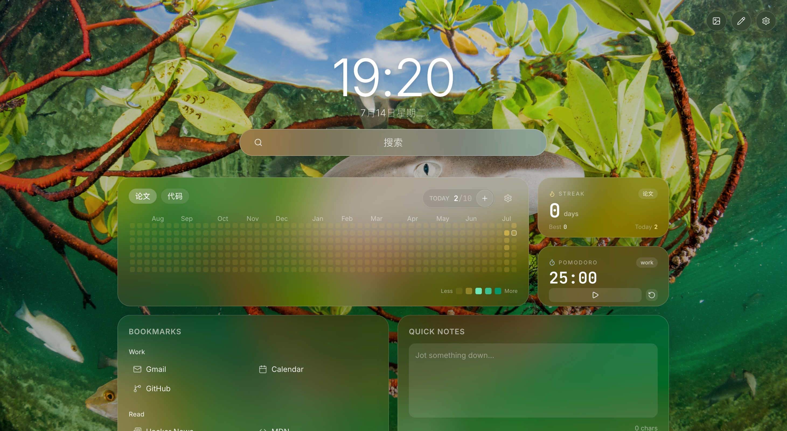

# tabstart

A personal browser start page & launchpad dashboard for your new tab.

## Getting Started

### install to your browser (Edge/Chrome)
```bash
bun install
bun run build:extension
```
load `dist` folder as an unpacked extension in your browser

## Widgets

| Widget | Description |
| --- | --- |
| Bookmarks | Editable bookmark grid |
| Quick Notes | Scratchpad notes |
| Heatmap | Activity heatmap |
| Streak | Win/loss streak tracker |
| Tasks (Todo) | Daily / weekly tasks & goals with recurrence |
| Kanban | 3-column board (drag & drop) + compact list with keyboard shortcuts (`j`/`k` select, `[`/`]` move, `Enter` done) |
| Pomodoro | Small / large timer variants |

> Tasks and Kanban share drag & drop — drag a task between the two widgets and it moves across (completion state follows).

## Plugins

Every grid widget is a **plugin**. Each plugin folder contains a
`plugin.tsx` (metadata + `apply` hook) and the component file(s).
Plugins live in two roots:

```text
src/plugins/<id>/plugin.tsx          built-in plugins (shipped with tabstart)
user-plugins/example/plugin.tsx      tracked template — copy this to write your own
user-plugins/<your-repo>/<plugin>/   your own plugins, managed in your own git repo
```

- Both `user-plugins/<plugin>/` (depth 1) and `user-plugins/<repo>/<plugin>/` (depth 2) are
  discovered, so you can keep several plugin repos side by side.
- Everything under `user-plugins/` is gitignored except `example/`, so your plugins stay in your
  own repository while the template ships with tabstart.
- Set `TABSTART_USER_PLUGINS=/some/dir` to point the loader at a different root.
- User plugins reach host APIs through the `@host/*` alias (e.g. `@host/plugins/runtime`,
  `@host/components/WidgetCard`); their own dependencies go in a per-plugin `package.json`.

The registry auto-discovers every folder with a `plugin.tsx` at build time via
`scripts/plugin-sync.ts` — no manual registration. User plugins are always bundled;
built-ins are toggled in `src/plugins/plugin.config.json`.

> **Before building** after a fresh clone (or when user plugins change), run
> `bun run plugin:sync`. It scans both plugin roots, installs per-plugin
> dependencies and writes the local `src/plugins/registry.generated.ts`
> (gitignored) and updates `tsconfig.app.json`. The `build` / `dev` scripts
> already run it first, but running it explicitly avoids stale-state surprises
> (e.g. a renamed user-plugin folder leaving old `node_modules/.vite` cache
> entries that break dev imports — clear `node_modules/.vite` if you hit that).

## TODO

- **Design flaw — generated registry hard-references external user plugins.**
  `src/plugins/registry.generated.ts` (and the user-plugin `include`/`@ext`
  paths in `tsconfig.app.json`) reference `user-plugins/…` folders that are
  gitignored here and live in separate repos. So after a fresh clone of this
  repo, the committed `tsconfig.app.json` can point at plugin folders that
  don't exist, and `registry.generated.ts` is ignored entirely — the build only
  works after running `plugin:sync` with the user plugins present. Ideally the
  registry should only bundle built-in plugins (plus anything present), or the
  user-plugin path should be tracked/configurable instead of silently embedded
  in generated files.

The plugin runtime is a small Cordis-style core: each plugin exports an `apply(ctx)` function and can
contribute widgets, UI slots, or themes through `ctx.widgets` / `ctx.slots` / `ctx.themes`. Plugins are
discovered at build time and mounted at runtime; MV3-safe, no remote code loading.

- The **plugin manager** (top-right) lists all plugins with enable/disable toggles. Disabling hides a
  plugin from the grid and the Add-Widget picker, but its layout position is preserved.
- Keys (API keys, etc.) are stored only in your local browser storage.

### Mini-Cordis runtime

`src/plugins/runtime.ts` is a small [Cordis](https://github.com/cordiverse/cordis)-style core. It does **not** load remote code; discovery stays
build-time and MV3-safe.

- **`HomepageContext`** — `effect()`, `on() / emit()`, `plugin()`, `get() / provide()` plus built-in registries.
- **`WidgetRegistry` / `SlotRegistry` / `ThemeRegistry`** — the three built-in extension surfaces.
- **`PluginFiber`** — one mounted plugin instance; `dispose()` rolls back every effect registered during `apply()`.
- **`defineWidgetPlugin(widget)`** — the fast path for the common “one plugin = one grid widget” case.

Runtime flow:

```text
scripts/plugin-sync.ts (build-time scan of both plugin roots)
  → src/plugins/registry.generated.ts (static imports, MV3-safe)
    → PluginHost mounts enabled plugins
      → apply(ctx) registers widgets / slots / themes
        → Dashboard / Slot / ThemeApplier consume registries
```

Built-in slot names: `hero.clock` and `hero.search` (provided by `src/plugins/core/plugin.tsx`).
Clock and search bar personalization (12/24-hour time, seconds, date, locale, default search
engine, an add/remove search engine list with custom engines, and per-engine keyboard shortcuts)
lives in **Settings → General**.
The active plugin theme is persisted in `homepage-active-theme`; `src/plugins/liquid-glass/` is a
theme-plugin example and can be selected in Settings → Appearance.

### Writing your own plugin

1. Copy `user-plugins/example/` to a new folder under `user-plugins/` (e.g.
   `user-plugins/my-plugins/myplugin/` — keep it at most two levels below the root).
2. Edit `plugin.tsx`: change the widget `id`, `name`, grid size (`defaultW/H`, `minW/H`), `order` and the
   `settings` schema (fields render automatically in Settings → Widgets). Export it with
   `export const plugins = [defineWidgetPlugin(widget)]`.
3. Rewrite the component. Available APIs: `WidgetCard`, `useWidgetSettings(widgetKey)` (persisted to
   local storage), and props `{ widgetKey, preview, compact }`.
4. If the plugin fetches a remote API, add the host to `host_permissions` in `public/manifest.json`
   (MV3 needs a static allow-list — there is no runtime prompt).
5. Rebuild (`bun run build:extension`) — the plugin appears in the picker and the manager automatically.

For reference, [this](https://github.com/Yang-Yiming/my-tabstart-plugins) is the repo of my user-plugins.

## Tech Stack

- React 19 + TypeScript + Vite
- Tailwind CSS 3
- react-grid-layout
- Lucide Icons

## preview



## License

MIT
